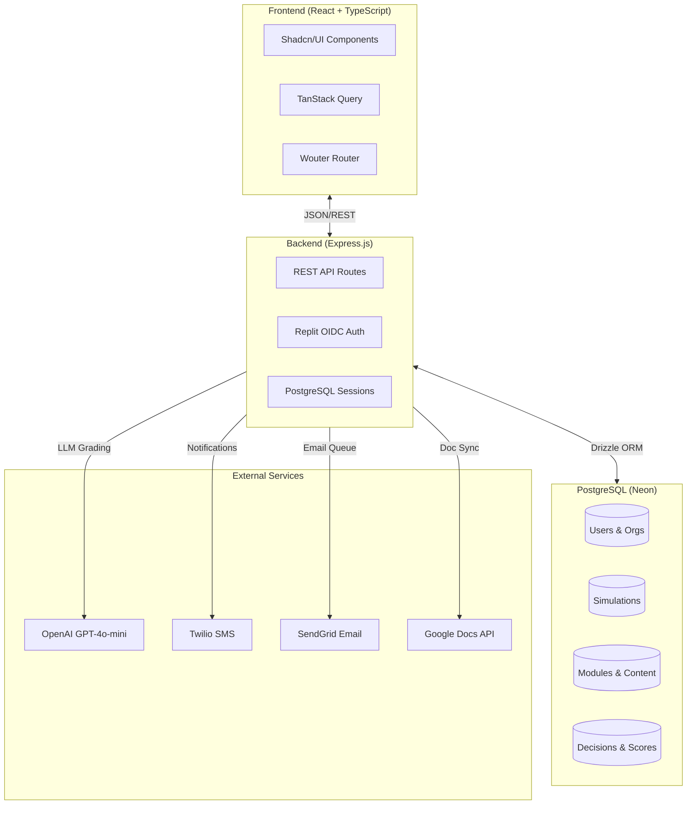
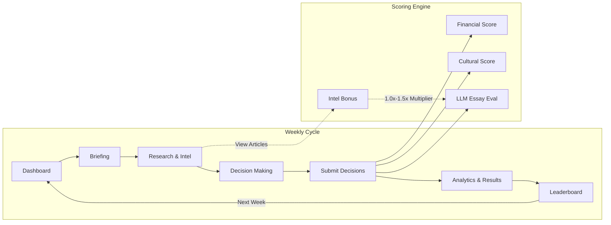
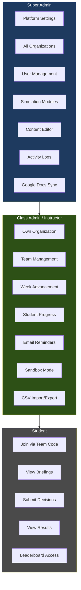
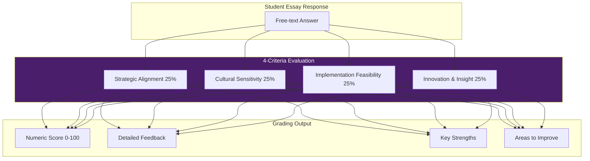
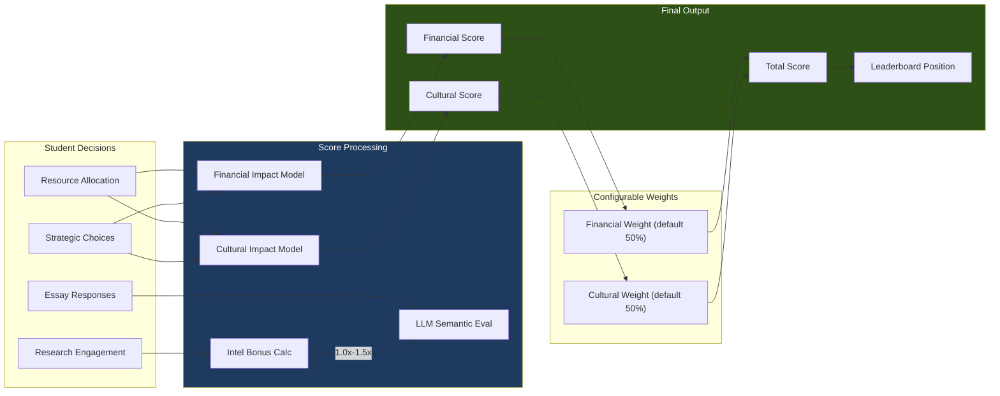
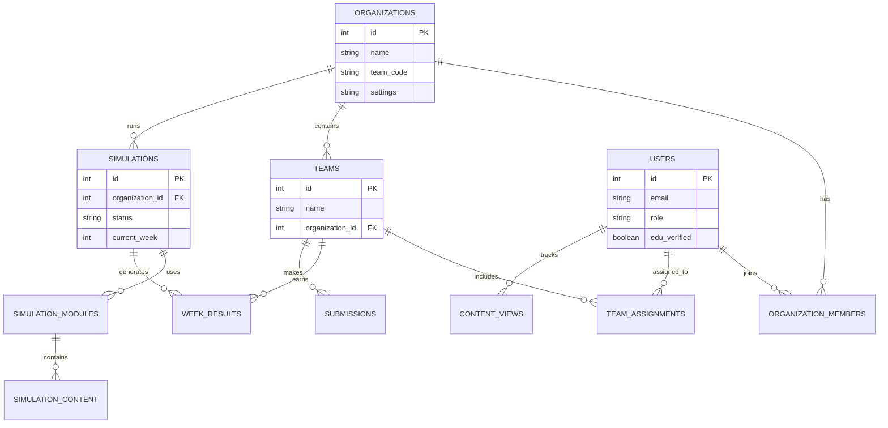
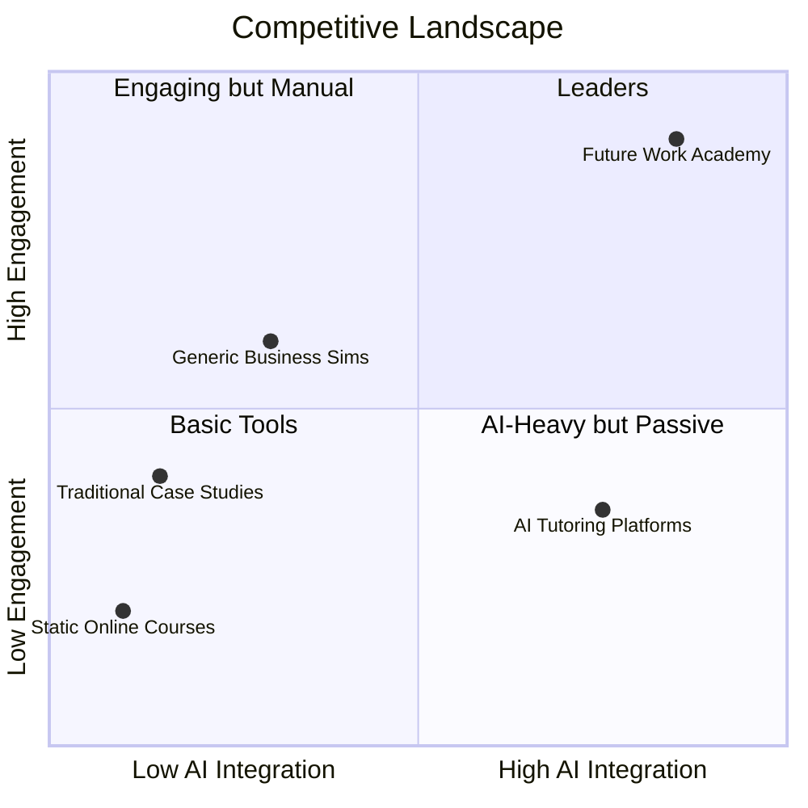
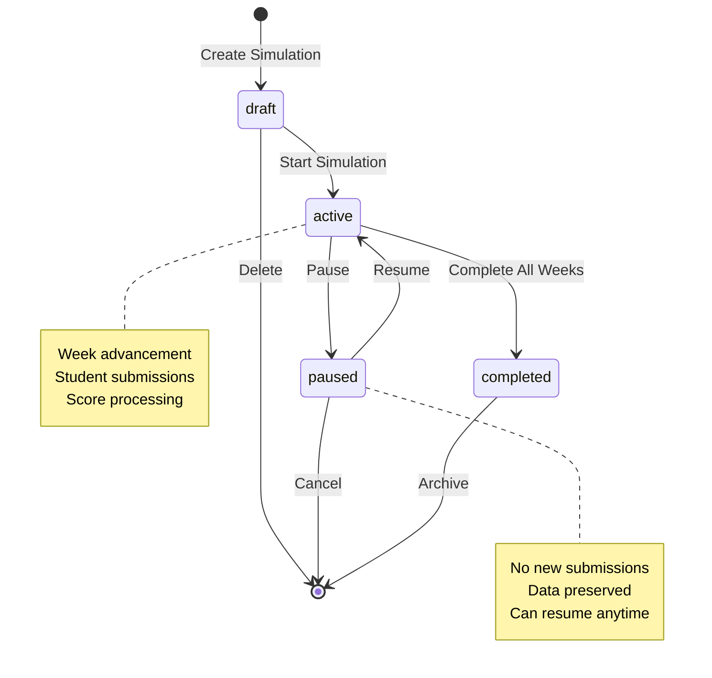
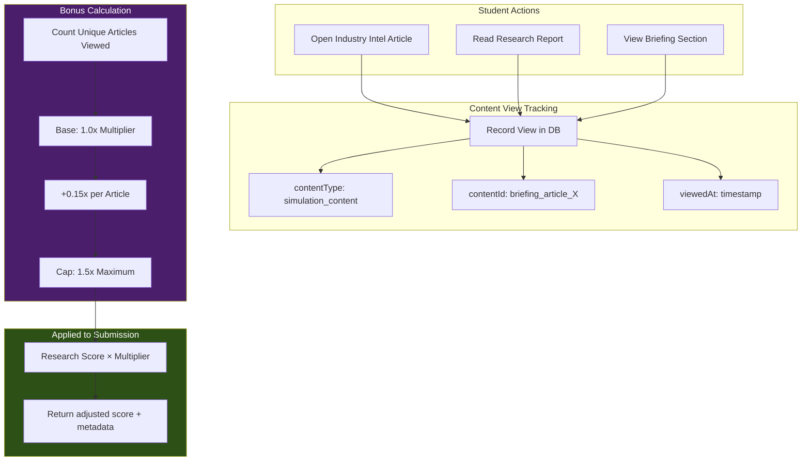
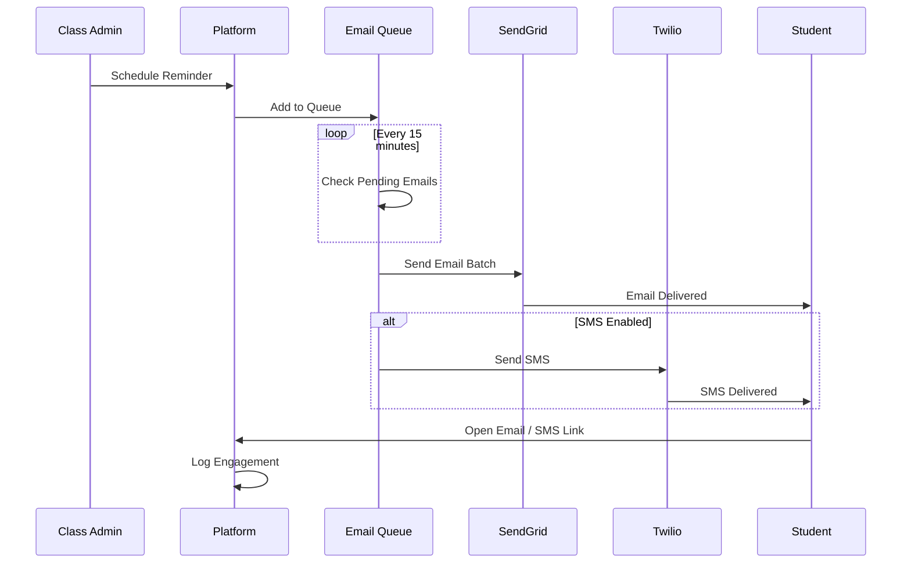

# Future Work Academy - Visual Appendix

**Version:** 1.1  
**Last Updated:** January 2026

This document contains all visual diagrams for presentations, documentation, and stakeholder materials. All diagrams use [Mermaid](https://mermaid.js.org/) syntax for version control and easy export.

---

## How to Export Diagrams

1. **Online Editor**: Copy any diagram code block to [mermaid.live](https://mermaid.live) → Download as PNG/SVG
2. **GitHub/GitLab**: These platforms render Mermaid natively in markdown preview
3. **VS Code**: Install "Markdown Preview Mermaid Support" extension
4. **CLI Export**: `npm install -g @mermaid-js/mermaid-cli` then `mmdc -i input.md -o output.png`

---

## 1. System Architecture

High-level overview of the platform's technical architecture.

---

## 2. Weekly Simulation Workflow

The student journey through each simulation week.

---

## 3. Role Hierarchy & Permissions

Three-tier access control system.

---

## 4. LLM-Powered Grading Rubric

Semantic evaluation criteria for essay responses.

---

## 5. Scoring System Overview

How final scores are calculated each week.

---

## 6. Multi-Tenant Data Model

Organization and team structure.

---

## 7. Competitive Positioning Matrix

Market differentiation against alternatives.

> **Note:** If the quadrant chart doesn't render in your environment, use the [mermaid.live editor](https://mermaid.live) to generate a PNG/SVG export.

---

## 8. Simulation Lifecycle States

Status transitions for simulation management.

---

## 9. Content Engagement Tracking Flow

How intel bonus multipliers are calculated.

---

## 10. Email/SMS Notification Flow

Automated reminder and notification system.

---

## Usage Notes

- **Colors**: Diagrams use the platform's brand colors (Corporate Navy #1e3a5f, Growth Green #2d5016, Tech Purple #4a1e6b)
- **Updates**: When features change, update the relevant diagram code and re-export
- **Presentations**: Export at 2x resolution for crisp slides
- **Print**: Use SVG format for vector quality in printed materials
