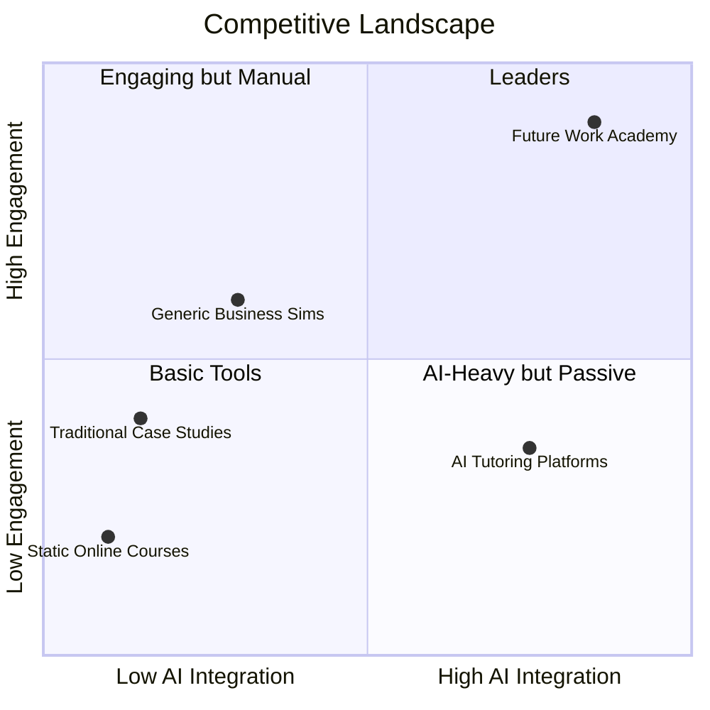

# Future Work Academy - Business Plan

**Prepared by:** The Mitchell Group, LLC  
**Version:** 1.3  
**Last Updated:** February 2026

---

## Executive Summary

Future Work Academy provides an immersive, AI-powered business simulation platform designed for graduate business programs. Our flagship product, "The Future of Work," enables students to navigate AI adoption, workforce transformation, and strategic decision-making over an 8-week simulation. The platform features transparent LLM-powered essay evaluation, dual scoring metrics (financial and cultural performance), and a Bloomberg Terminal-inspired professional interface.

**Key Value Proposition:**
- Prepare future leaders for AI-driven decision-making in a risk-free environment
- Transparent AI grading with visible rubrics eliminates "black box" concerns
- Multi-tenant architecture supports individual instructors and institutional deployments
- Unified Role Preview lets Super Admins experience the platform as any role on any organization
- Public guide pages (`/guides/student`, `/guides/instructor`) provide self-service onboarding with PDF download
- Immersive character ecosystem with AI-generated stakeholder profiles brings the simulation to life
- Triggered voicemail notifications create authentic pressure and emotional engagement
- Phone-a-Friend advisor system provides on-demand AI-powered expert guidance
- Public onboarding guides with PDF download for students and instructors

**Target Market:** MBA programs, MS in Analytics, Executive Education, and undergraduate business programs at accredited institutions.

**Business Model:** SaaS subscription with tiered pricing based on student count and feature access.

---

## Market Opportunity

### The Problem
- Business schools struggle to provide experiential learning at scale
- Traditional case studies lack the iterative decision-making of real business
- AI tools are transforming workplaces, but curricula lag behind
- Instructors need assessment tools that are both rigorous and efficient

### Market Size
- **TAM (Total Addressable Market):** $5.3B - Global higher education simulation and experiential learning market
- **SAM (Serviceable Addressable Market):** $890M - Business simulation software for accredited MBA/business programs
- **SOM (Serviceable Obtainable Market):** $45M - AI-focused business simulations for graduate programs (Year 3 target)

### Market Trends
- Growing adoption of experiential learning in business education
- AACSB accreditation increasingly emphasizes technology integration
- Corporate training budgets shifting to simulation-based learning
- Demand for AI literacy across all business functions

### Target Customers
1. **Primary:** AACSB-accredited MBA programs (800+ schools globally)
2. **Secondary:** MS in Analytics, Management, and HR programs
3. **Tertiary:** Executive Education programs and corporate training

---

## Revenue Model & Pricing Strategy

### Pricing Tiers

| Tier | Monthly Price | Annual Price | Students | Features |
|------|---------------|--------------|----------|----------|
| **Starter** | $299/mo | $2,990/yr | Up to 50 | 1 simulation module, basic analytics, email support |
| **Professional** | $599/mo | $5,990/yr | Up to 150 | All modules, advanced analytics, priority support, Sandbox Mode |
| **Institutional** | $1,499/mo | $14,990/yr | Up to 500 | All features + SSO, LMS integration, dedicated success manager |
| **Enterprise** | Custom | Custom | Unlimited | White-label, custom content, SLA guarantees, on-site training |

### Per-Student Pricing (Alternative Model)
- $25/student/semester for courses under 30 students
- $20/student/semester for 30-100 students
- $15/student/semester for 100+ students
- Volume discounts for multi-year institutional agreements

### Revenue Projections

| Year | Subscribers | ARR | Notes |
|------|-------------|-----|-------|
| Year 1 | 15 programs | $150K | Pilot phase, 10 Starter + 5 Professional |
| Year 2 | 50 programs | $500K | Growth phase, mix of tiers |
| Year 3 | 150 programs | $1.5M | Scale phase, institutional deals |
| Year 5 | 400 programs | $5M | Market expansion, enterprise clients |

---

## Operating Costs

### Monthly Infrastructure Costs (Current)

| Service | Cost/Month | Notes |
|---------|------------|-------|
| **Replit Hosting** | $25-100 | Scales with usage |
| **PostgreSQL (Neon)** | $0-25 | Included with Replit |
| **OpenAI API (GPT-4o-mini)** | $50-500 | ~$0.15 per essay evaluation, scales with students |
| **Twilio SMS** | $25-100 | Enrollment notifications, ~$0.0079/message |
| **SendGrid Email** | $0-20 | Free tier covers most usage, Pro at scale |
| **Domain & SSL** | $15 | futureworkacademy.com |
| **Total (Low)** | ~$115/mo | Pilot phase with minimal students |
| **Total (Growth)** | ~$500-1,000/mo | 500-1,000 active students |

### Monthly Cost Projections by Scale

| Active Students | OpenAI | Twilio | SendGrid | Hosting | Total |
|-----------------|--------|--------|----------|---------|-------|
| 100 | $50 | $25 | $0 | $50 | $125 |
| 500 | $200 | $50 | $20 | $100 | $370 |
| 1,000 | $400 | $100 | $35 | $200 | $735 |
| 5,000 | $2,000 | $500 | $100 | $500 | $3,100 |

### Personnel Costs (Future)

| Role | Annual Cost | Phase |
|------|-------------|-------|
| Founder/CEO (Doug Mitchell) | $0-80K | Year 1-2 (deferred/minimal) |
| Part-time Developer | $50-80K | Year 2+ |
| Customer Success Manager | $60-80K | Year 2+ |
| Content Developer | $50-70K | Year 2+ (or contracted) |
| Sales/BD | $70-100K + commission | Year 3+ |

---

## Compliance & Certification Costs

### Essential for Academic Sales

Higher education institutions require vendors to meet specific security and compliance standards. These are often non-negotiable for procurement.

#### 1. SOC 2 Type II Certification

**What it is:** Third-party audit verifying security controls for data protection, availability, and confidentiality.

**Why it matters:** Required by most universities for vendors handling student data. Often a prerequisite for procurement.

**Cost Estimates:**
| Component | Low Estimate | High Estimate | Notes |
|-----------|--------------|---------------|-------|
| Readiness Assessment | $5,000 | $15,000 | Gap analysis and remediation plan |
| Implementation Support | $10,000 | $25,000 | Policies, procedures, controls |
| Audit (Type I first year) | $15,000 | $30,000 | Point-in-time assessment |
| Audit (Type II ongoing) | $20,000 | $50,000 | 6-12 month observation period |
| Compliance Software (Vanta, Drata) | $6,000 | $24,000/yr | Automation tools |
| **Total Year 1** | **$36,000** | **$94,000** | |
| **Annual Renewal** | **$26,000** | **$74,000** | Ongoing audit + tools |

**Timeline:** 6-12 months for Type II certification

#### 2. FERPA Compliance

**What it is:** Family Educational Rights and Privacy Act - federal law protecting student education records.

**Why it matters:** Mandatory for any vendor handling student data on behalf of educational institutions.

**Cost Estimates:**
| Component | Low Estimate | High Estimate | Notes |
|-----------|--------------|---------------|-------|
| Legal Review & Policies | $3,000 | $10,000 | Privacy policy, data handling |
| Data Protection Agreement Templates | $2,000 | $5,000 | Institution-ready DPAs |
| Staff Training | $500 | $2,000 | Online courses, documentation |
| Technical Controls Implementation | $5,000 | $15,000 | Access controls, audit logs, encryption |
| **Total** | **$10,500** | **$32,000** | One-time + minimal ongoing |

**Timeline:** 2-3 months

#### 3. HECVAT (Higher Education Community Vendor Assessment Toolkit)

**What it is:** Standardized questionnaire for evaluating cloud vendor security. Most universities require completion before procurement.

**Why it matters:** Completing HECVAT demonstrates security posture and speeds procurement. Universities share results through consortium.

**Cost Estimates:**
| Component | Low Estimate | High Estimate | Notes |
|-----------|--------------|---------------|-------|
| Initial HECVAT Completion | $2,000 | $8,000 | Self-completion with consultant review |
| Documentation Preparation | $3,000 | $10,000 | Policies, procedures, evidence |
| Annual Update | $1,000 | $3,000 | Refreshing responses |
| **Total Year 1** | **$5,000** | **$18,000** | |
| **Annual Maintenance** | **$1,000** | **$3,000** | |

**Timeline:** 1-2 months

#### 4. Penetration Testing & Security Audit

**What it is:** Third-party security assessment identifying vulnerabilities.

**Why it matters:** Often required annually by institutional IT security offices.

**Cost Estimates:**
| Component | Low Estimate | High Estimate | Notes |
|-----------|--------------|---------------|-------|
| Web Application Pen Test | $5,000 | $15,000 | OWASP methodology |
| API Security Assessment | $3,000 | $8,000 | Included in some web tests |
| Remediation Support | $2,000 | $10,000 | Fixing identified issues |
| **Total Per Engagement** | **$10,000** | **$33,000** | Annual or upon major changes |

**Timeline:** 2-4 weeks

#### 5. Accessibility Compliance (WCAG 2.1 AA / Section 508)

**What it is:** Web Content Accessibility Guidelines ensuring platform is usable by people with disabilities.

**Why it matters:** Public universities require Section 508 compliance. Private institutions increasingly require WCAG 2.1 AA.

**Cost Estimates:**
| Component | Low Estimate | High Estimate | Notes |
|-----------|--------------|---------------|-------|
| Accessibility Audit | $3,000 | $10,000 | Automated + manual testing |
| Remediation Development | $5,000 | $25,000 | Fixing issues (depends on scope) |
| VPAT (Voluntary Product Accessibility Template) | $2,000 | $5,000 | Documentation for procurement |
| Ongoing Testing Tools | $500 | $2,000/yr | Automated scanners |
| **Total Year 1** | **$10,500** | **$42,000** | |
| **Annual Maintenance** | **$2,000** | **$7,000** | |

**Timeline:** 2-4 months

#### 6. Cyber Liability Insurance

**What it is:** Insurance covering data breaches, cyber incidents, and related liabilities.

**Why it matters:** Often required by institutional contracts. Protects against catastrophic loss.

**Cost Estimates:**
| Coverage Level | Annual Premium | Notes |
|----------------|----------------|-------|
| $1M coverage | $2,000 - $5,000 | Typical for small SaaS |
| $2M coverage | $4,000 - $8,000 | Often required by universities |

### Total Compliance Investment Summary

| Phase | Low Estimate | High Estimate | Priority |
|-------|--------------|---------------|----------|
| **Year 1 (Minimum Viable Compliance)** | | | |
| FERPA Compliance | $10,500 | $32,000 | Critical |
| HECVAT Completion | $5,000 | $18,000 | Critical |
| Basic Pen Test | $10,000 | $20,000 | High |
| Cyber Insurance | $3,000 | $6,000 | High |
| **Year 1 Total** | **$28,500** | **$76,000** | |
| | | | |
| **Year 2 (Full Compliance)** | | | |
| SOC 2 Type II | $36,000 | $94,000 | High |
| Accessibility Audit + VPAT | $10,500 | $42,000 | Medium-High |
| **Year 2 Additional** | **$46,500** | **$136,000** | |
| | | | |
| **Annual Ongoing (Year 3+)** | **$35,000** | **$90,000** | Maintenance |

### Compliance Roadmap Recommendation

**Phase 1 (Pre-Revenue / Pilots):**
- Complete FERPA self-assessment and documentation
- Begin HECVAT preparation
- Basic security hardening

**Phase 2 (First Institutional Customers):**
- Complete HECVAT
- Conduct pen test
- Obtain cyber liability insurance
- Complete FERPA compliance package

**Phase 3 (Scale to Enterprise):**
- Pursue SOC 2 Type II
- Complete accessibility audit and VPAT
- Implement compliance automation (Vanta/Drata)

---

## Competitive Landscape

### Competitive Positioning

> **Note:** If the quadrant chart doesn't render in your environment, use the [mermaid.live editor](https://mermaid.live) to generate a PNG/SVG export.

### Direct Competitors

| Competitor | Strengths | Weaknesses | Pricing |
|------------|-----------|------------|---------|
| **Capsim** | Established brand, wide adoption | Dated interface, no AI grading | $50-100/student |
| **Stukent Mimic** | Modern UI, marketing focus | Limited AI/workforce themes | $40-80/student |
| **Harvard Business Publishing Simulations** | Brand prestige, quality content | Expensive, rigid format | $50-150/student |
| **Marketplace Simulations** | Good instructor tools | Older technology | $30-60/student |

### Competitive Advantages

1. **AI-Native Design:** Built for the AI era, not retrofitted
2. **Transparent LLM Grading:** Open rubric eliminates black-box concerns
3. **Modern Tech Stack:** Bloomberg-inspired interface, real-time updates
4. **Instructor Sandbox:** Preview entire student experience risk-free
5. **Dual Scoring:** Financial AND cultural metrics reflect modern leadership
6. **Multi-Channel Notifications:** SMS + email keeps students engaged

---

## Go-to-Market Strategy

### Phase 1: Founder-Led Sales (Year 1)
- Leverage Doug Mitchell's professional network
- Target 10-15 pilot programs at known institutions
- Focus on MBA and MS Analytics programs
- Gather testimonials and case studies
- Refine product based on instructor feedback

### Phase 2: Content Marketing & Inbound (Year 1-2)
- Publish thought leadership on AI in business education
- Present at AACSB conferences and business school events
- Develop webinar series for faculty development
- SEO optimization for "business simulation" and related terms

### Phase 3: Partner Channel (Year 2-3)
- Develop LMS integration partnerships (Canvas, Blackboard)
- Explore textbook publisher partnerships
- Create affiliate program for business school consortia

### Phase 4: Enterprise Sales (Year 3+)
- Hire dedicated sales team
- Target institutional-level agreements
- Develop white-label offering for large programs
- International expansion (English-speaking markets first)

---

## Investment Requirements

### Bootstrap Phase (Current - Month 12)
- **Capital Needed:** $0-25,000
- **Source:** Founder investment, early customer revenue
- **Use:** Operating costs, initial compliance work

### Seed Phase (Month 12-24)
- **Capital Needed:** $150,000 - $300,000
- **Source:** Angel investors, revenue reinvestment
- **Use:** 
  - SOC 2 certification ($50-100K)
  - Part-time developer ($50-80K)
  - Marketing/sales ($30-50K)
  - Working capital ($20-70K)

### Series A Readiness (Month 24-36)
- **Target Metrics:**
  - $500K+ ARR
  - 50+ active programs
  - SOC 2 Type II certified
  - Positive unit economics

---

## Key Metrics & Milestones

### Year 1 Milestones
- [ ] 10 pilot programs launched
- [ ] $100K ARR
- [ ] FERPA + HECVAT complete
- [ ] First case study published
- [ ] 90%+ instructor satisfaction

### Year 2 Milestones
- [ ] 50 programs
- [ ] $500K ARR
- [ ] SOC 2 Type II certified
- [ ] LMS integration (Canvas)
- [ ] 2 additional simulation modules
- [ ] First institutional deal

### Year 3 Milestones
- [ ] 150 programs
- [ ] $1.5M ARR
- [ ] First enterprise/white-label customer
- [ ] Accessibility certified (VPAT)
- [ ] International customer acquisition

---

## Risk Factors & Mitigation

| Risk | Likelihood | Impact | Mitigation |
|------|------------|--------|------------|
| Slow enterprise sales cycle | High | Medium | Focus on SMB (individual instructors) for initial revenue |
| AI grading skepticism from faculty | Medium | High | Transparent rubric, instructor override capability, sandbox testing |
| LLM cost increases | Medium | Medium | Model flexibility, caching, prompt optimization |
| Competitor response | Medium | Medium | First-mover advantage in AI-native simulation |
| Regulatory changes (AI in education) | Low | High | Monitor legislation, maintain human oversight options |
| Key person risk (founder) | Medium | High | Document processes, build advisory board |

---

## Appendix A: Contact Information

- **Founder:** Doug Mitchell
- **Email:** doug@futureworkacademy.com
- **Website:** futureworkacademy.com
- **Entity:** The Mitchell Group, LLC

---

## Appendix B: Visual Diagrams

For presentation-ready visual assets including system architecture, data models, workflow diagrams, and competitive positioning charts, see [APPENDIX_DIAGRAMS.md](./APPENDIX_DIAGRAMS.md).

---

*This document is confidential and intended for internal planning and potential investor discussions.*
