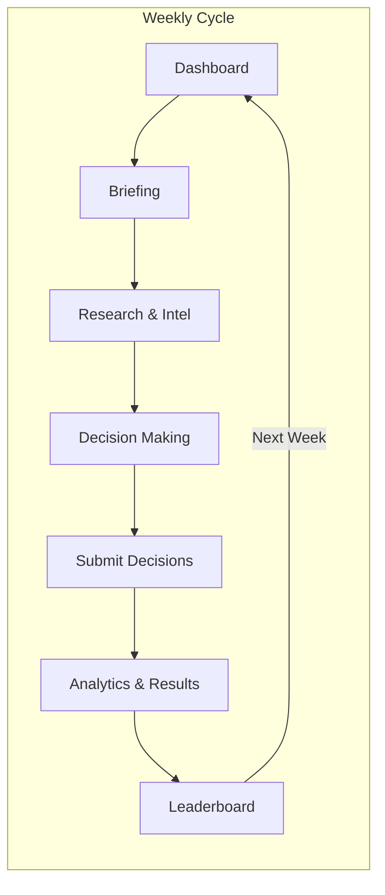
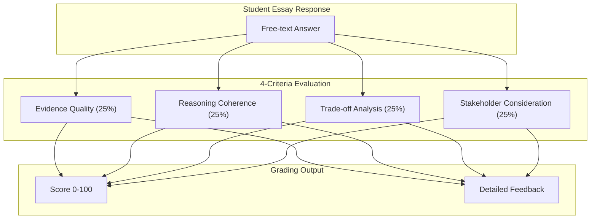

# Future Work Academy - Marketing Materials

**Version:** 1.2  
**Last Updated:** January 2026

> **Note:** Additional visual diagrams (system architecture, data models, notification flows) available in [APPENDIX_DIAGRAMS.md](./APPENDIX_DIAGRAMS.md)

---

## VERSION 1: Graduate Business Programs (MBA/MS Analytics)

### The Future of Work Simulation
*Prepare Tomorrow's Leaders for AI-Driven Decision Making*

---

### What is The Future of Work?

An 8-week immersive business simulation where students step into the role of executives at Apex Manufacturing, navigating the real-world challenges of AI adoption, workforce transformation, and strategic decision-making. Students compete on both financial performance and cultural health - reflecting the dual pressures modern leaders face.

---

### Key Highlights

- **Executive-Level Decision Making**: Students allocate resources across AI deployment, employee reskilling, lobbying efforts, and union relations

- **Bloomberg Terminal-Inspired Interface**: Professional-grade dashboard mirrors the tools used in industry

- **Dual Scoring System**: Financial metrics AND cultural health scores - because sustainable success requires both

- **Team-Based Competition**: Leaderboards foster healthy competition while encouraging collaborative strategy

- **Weekly Intelligence Briefings**: Curated content simulates the information flow real executives navigate

- **Instructor Sandbox Mode**: Test the complete student experience - jump to any week, make decisions, see AI feedback - before going live with your class

- **Multi-Channel Notifications**: SMS alerts for real-time enrollment updates, plus automated emails for invitations, reminders, and weekly results

- **Post-Week Feedback & Peer Learning**: Detailed performance analysis, rubric scores, and anonymized top responses after each decision cycle

- **Interactive Industry Intelligence**: Clickable briefing articles with full content, key insights, and downloadable summaries - students can dive deep into optional research materials

- **Intel Engagement Bonus**: Students who read Industry Intelligence articles receive score bonuses (up to 1.5x multiplier), rewarding thorough research habits

- **Seamless Navigation**: Breadcrumb navigation across Research, Briefing, and Decisions pages helps students move intuitively through the weekly workflow

- **Content Engagement Tracking**: Cross-session persistence tracks which materials students have viewed, providing instructors with engagement analytics

- **Google Docs Integration**: Business documentation syncs automatically to Google Docs for easy sharing with stakeholders

- **Living Character Ecosystem**: Meet 17 distinct AI-powered stakeholders - from the visionary CEO to the skeptical Union Leader - each with unique personalities, motivations, and AI-generated professional headshots that bring the simulation to life

- **Triggered Voicemail Notifications**: Receive unexpected "voicemails" from simulation characters at critical moments - when you cross a performance threshold, make a controversial decision, or miss a deadline. These audio messages create authentic pressure and emotional stakes

- **Phone-a-Friend Advisor System**: Stuck on a tough decision? Use one of your three "lifelines" to consult with specialized advisors (Finance, HR, Legal, Technology, Ethics, and more). Each advisor provides AI-generated contextual guidance tailored to your specific situation

- **Rich Media Content**: Weekly briefings include video and audio content with full transcripts, dynamic reading/viewing time estimates, and engagement tracking across all media types

- **Self-Service Demo Access**: Instantly explore the platform with 30-day evaluator access - no .edu email required. Perfect for faculty, corporate trainers, and L&D professionals alike

- **Guided Tour & AI Assistant**: New evaluators receive an interactive guided tour highlighting key features, plus an AI-powered Q&A assistant to answer questions in real-time

---

### Try It Yourself: Self-Service Demo

Experience the simulation firsthand with our no-commitment demo environment:

**Getting Started:**
1. Visit the "For Academia" page
2. Request 30-day evaluator access with any work email (no .edu required)
3. Sign in to explore a pre-populated sandbox with 6 fake students across 3 teams
4. Jump to Week 3 to see a mid-simulation view with established scores and history

**What's Included:**
- **Interactive Guided Tour**: Auto-launching walkthrough of key dashboard features
- **AI-Powered Q&A**: Ask questions about the platform in real-time with our Gemini-powered assistant
- **Complete Student Experience**: Make decisions, see AI feedback, explore the character system
- **Instructor Views**: Access admin dashboards, analytics, and roster management
- **Isolated Sandbox**: All demo data is fictional and completely separate from production

**Perfect For:**
- Faculty evaluating for curriculum integration
- Corporate L&D teams exploring experiential training options
- Business school administrators assessing technology investments
- Workforce development professionals seeking simulation-based learning tools

---

### Research-Backed Pedagogy

Our simulation design is grounded in peer-reviewed research on business simulation games (BSGs) and experiential learning:

**Academic Validation:**
- **Systematic Review of BSG Effectiveness (45+ studies)**: Business simulation games significantly boost student engagement, knowledge acquisition, and skill development compared to traditional lectures. BSGs are particularly effective for teaching business processes and decision-making under uncertainty. *(Vlachopoulos & Makri, International Journal of Management Education, 2022)*

- **Flow States & Self-Efficacy in Simulations**: Students who experience "flow" states in realistic simulation scenarios demonstrate measurably improved skill development and self-efficacy. Our Bloomberg Terminal-inspired interface and competitive leaderboards are specifically designed to create these conditions. *(Frontiers in Psychology, 2022)*

- **Post-Pandemic BSG Adoption Trends**: Business simulation adoption in higher education has accelerated dramatically. BSGs excel at teaching decision-making skills that are difficult to assess through traditional exams. *(MDPI Education Sciences, 2025)*

**Industry-Validated Premise:**
- **Deloitte/Manufacturing Institute**: 2.1 million manufacturing jobs projected unfilled by 2030 due to skills gaps *(updated 2024 projections estimate 1.9-3.8M net need by 2033)*
- **Bureau of Labor Statistics (2025)**: 415,000 current manufacturing openings, with AI/automation reshaping job requirements
- **Korn Ferry/Deloitte Surveys (2024-2025)**: 72% of Gen Z employees express reluctance to pursue management roles - a leadership pipeline crisis our simulation directly addresses

**Dual Scoring Innovation:**
Our Financial + Cultural Health dual-scoring system reflects emerging ESG (Environmental, Social, Governance) trends in business education. Unlike single-metric simulations, students learn that sustainable success requires balancing short-term gains with long-term organizational health.

---

### FERPA-Ready Platform

Built for institutional adoption from day one:

- **SOC 2 Type I-Aligned Architecture**: Enterprise-grade security controls designed to meet audit standards
- **FERPA-Aligned Data Handling**: Student records protected per federal education privacy requirements
- **Privacy-First AI Processing**: Institutional API keys ensure student work remains private; no training on user data
- **Comprehensive Audit Trail**: Every action logged with timestamps for compliance verification
- **Secure SSO Integration**: OIDC authentication eliminates password management risks
- **Data Minimization**: We collect only what's educationally necessary

**See our full [Security & Compliance Documentation](./SECURITY_COMPLIANCE.md) for detailed architecture, incident response procedures, and data handling policies.**

---

### The Weekly Workflow



1. **Review Intelligence Briefing** - Students analyze curated industry news, market signals, and emerging trends

2. **Make Strategic Decisions** - Resource allocation across multiple competing priorities with both structured inputs and open-ended strategic justifications

3. **Receive AI-Evaluated Feedback** - Immediate, detailed performance analysis with transparent scoring

4. **Track Progress** - Dashboard updates with new metrics, rank changes, and competitive standings

5. **Iterate** - Apply lessons learned to the next week's challenges

---

### Meet the Cast: AI-Powered Characters That Feel Real

The simulation features 17 distinct stakeholder characters, each with:

- **AI-Generated Professional Headshots**: Unique, consistent visual identities created by advanced AI
- **Rich Backstories**: Career history, personality traits, communication styles, and hidden motivations
- **Dynamic Relationships**: Characters reference each other, creating a believable organizational ecosystem
- **Authentic Communication**: Each character has a distinct voice - from the data-driven CFO to the passionate Union Representative

**Character Roles Include:**
- C-Suite Executives (CEO, CFO, COO, CTO, CHRO)
- Department Heads and Middle Managers
- Union Leadership and Employee Representatives
- External Stakeholders (Board Members, Investors, Regulators)
- Subject Matter Experts and Consultants

---

### Triggered Voicemails: Pressure When It Matters

Experience the urgency of real leadership through our triggered voicemail system:

- **Context-Sensitive Timing**: Voicemails arrive based on your decisions, performance thresholds, or simulation events
- **Character-Specific Messages**: Each voicemail comes from a specific stakeholder with their unique perspective
- **Urgency Levels**: From routine check-ins to urgent escalations that demand immediate attention
- **Emotional Stakes**: Audio messages create psychological pressure that text alone cannot replicate

**Trigger Examples:**
- The CEO calls when your financial score drops below target
- The Union Leader leaves a pointed message after layoff decisions
- The Board Chair reaches out when your cultural health score is concerning
- Random "pulse check" calls that keep you on your toes

---

### Phone-a-Friend: Expert Advice When You Need It Most

Stuck on a critical decision? Our advisor system provides on-demand AI-powered guidance:

**9 Specialized Advisors:**
- **Finance Advisor**: Capital allocation, ROI analysis, debt management
- **HR Advisor**: Workforce planning, employee relations, reskilling strategies
- **Operations Advisor**: Process optimization, automation implementation
- **Legal Advisor**: Compliance, liability, contractual considerations
- **Union Relations Advisor**: Collective bargaining, labor relations
- **Technology Advisor**: AI/automation technical feasibility and risks
- **Marketing Advisor**: Brand impact, stakeholder communication
- **Strategy Advisor**: Competitive positioning, long-term planning
- **Ethics Advisor**: Moral implications, stakeholder fairness

**How It Works:**
1. Click "Phone-a-Friend" during any decision
2. Select your advisor specialty
3. Receive AI-generated contextual advice tailored to your specific situation
4. Each student gets 3 lifeline uses per simulation - use them wisely!

---

### LLM-Powered Essay Evaluation: Transparency by Design

Unlike black-box AI grading, our system provides complete transparency:



**The 4-Criteria Rubric (25 points each, 100 total)**

- **Evidence Quality**: Are claims supported by data, research, or concrete examples?
- **Reasoning Coherence**: Is the argument logically structured and internally consistent?
- **Trade-off Analysis**: Does the response acknowledge competing priorities and constraints?
- **Stakeholder Consideration**: Are diverse perspectives (employees, shareholders, community) addressed?

**What Students See:**
- The full rubric BEFORE they write (no guessing what's expected)
- Detailed scores per criterion AFTER submission
- Specific strengths and areas for improvement
- Anonymized top-scoring responses from their cohort for peer learning

---

### Frequently Asked Questions

**Q: How much time does this require per week?**
A: Students typically spend 30-45 minutes per week reviewing briefings and making decisions. The simulation runs asynchronously, so students complete work on their own schedule within the weekly window.

**Q: Can I preview the simulation before my students start?**
A: Absolutely. Our Sandbox Mode lets you experience the full student journey - jump to any week, submit decisions, and receive AI feedback. Test everything before going live, with no impact on real student data.

**Q: Can I customize the simulation for my course?**
A: Yes. Class Admins can configure simulation duration (4-12 weeks), scoring weights (financial vs. cultural emphasis), and enrollment requirements (including optional .edu email verification).

**Q: Can I add my own content or scenarios?**
A: Yes! Our AI-powered Simulation Content Editor allows Super Admins to create and manage custom simulation modules with weekly briefings, research reports, and decision scenarios. The editor includes AI enhancement tools to improve clarity, expand details, simplify content, add data points, or generate new scenarios - making content creation fast and professional.

**Q: How are teams formed?**
A: You can assign teams manually, allow self-selection, or use individual mode. CSV bulk import supports up to 500 students at once, with automatic email invitations.

**Q: What if a student misses a week?**
A: The simulation tracks individual progress. Students can catch up, though competitive rankings reflect real-time participation. Instructors can send scheduled email reminders to encourage timely completion.

**Q: Is the AI grading fair?**
A: The transparent rubric ensures students know exactly how they are evaluated. LLM scoring focuses on reasoning quality, not keyword matching. Every criterion is visible before, during, and after submission.

**Q: What are the character profiles and voicemails?**
A: The simulation features 17 distinct AI-powered stakeholder characters (CEO, CFO, Union Leader, etc.) with unique personalities and AI-generated professional headshots. These characters send "triggered voicemails" at critical moments - when students cross performance thresholds, make controversial decisions, or need a nudge. The audio messages create authentic emotional stakes and pressure.

**Q: How does Phone-a-Friend work?**
A: Students get 3 "lifeline" uses per simulation. When stuck on a tough decision, they can consult one of 9 specialized advisors (Finance, HR, Legal, Technology, Ethics, etc.). Each advisor provides AI-generated contextual guidance tailored to the student's specific situation and decision context.

**Q: What analytics do I get as an instructor?**
A: Comprehensive activity logs, participation tracking, score distributions, and exportable reports (CSV/JSON) for integration with your LMS. You will also receive real-time SMS notifications when students enroll and automated email summaries of weekly results.

**Q: How do I stay informed about class activity?**
A: Multi-channel notifications keep you in the loop - SMS alerts for new enrollments, automated emails for weekly deadlines and results, plus a detailed activity log in your dashboard.

---

### Perfect For:

- Strategy courses exploring technology disruption
- Organizational Behavior units on change management
- HR/People Analytics modules on workforce transformation
- Capstone experiences requiring integrated decision-making
- Executive Education programs on digital leadership

---

## VERSION 2: Generic Academia (Multi-Module)

### Future Work Academy Simulations
*Experiential Learning for Complex Decision-Making*

---

### What Is This Platform?

A multi-scenario simulation platform where students take on leadership roles, make high-stakes decisions, and receive immediate, transparent feedback. Each module presents a different challenge domain - from AI workplace transformation to supply chain resilience - all using the same proven pedagogical framework.

---

### Platform Highlights

- **Modular Design**: Choose from multiple simulation themes to match your curriculum

- **Authentic Decision Environments**: Students face realistic trade-offs with incomplete information

- **Dual Performance Metrics**: Quantitative outcomes AND qualitative factors (culture, ethics, stakeholder impact)

- **Transparent AI Evaluation**: Open rubrics with detailed feedback on written responses

- **Flexible Administration**: Configure duration, team structures, and scoring emphasis to fit your course

- **Try Before You Teach**: Sandbox Mode lets instructors experience the full student journey - jump to any week, make decisions, receive AI feedback - before going live

- **Multi-Channel Notifications**: SMS alerts for real-time enrollment updates, plus automated emails for invitations, reminders, and weekly results

- **Scalable Enrollment**: Bulk CSV import for up to 500 students with automatic email invitations

- **Interactive Research Materials**: Students click into detailed intelligence articles with key insights and downloadable summaries

- **Engagement-Based Scoring**: Students who explore optional research materials earn score bonuses, encouraging deep learning

- **Intuitive Navigation**: Breadcrumb navigation helps students move seamlessly through weekly content

- **Content Analytics**: Track which materials students engage with across sessions

- **Character-Driven Narratives**: AI-powered stakeholder characters with unique personalities, AI-generated headshots, and authentic communication styles

- **Triggered Notifications**: Context-sensitive voicemails from simulation characters create emotional stakes and authentic pressure

- **Expert Advisor System**: "Phone-a-Friend" lifelines connect students with specialized AI advisors (Finance, Legal, HR, Ethics, Technology, and more) for on-demand guidance

- **Multimedia Briefings**: Video and audio content with transcripts, dynamic viewing time estimates, and engagement tracking

---

### Research-Backed Pedagogy

Our platform is built on decades of research validating business simulation games for higher education:

- **Vlachopoulos & Makri (2022)**: BSGs outperform lectures for engagement, knowledge retention, and skill development *(International Journal of Management Education)*
- **Flow & Self-Efficacy Research**: Flow states in realistic simulations drive measurable self-efficacy gains *(Frontiers in Psychology, 2022)*
- **Post-Pandemic Trends**: BSG adoption accelerating; proven effective for decision-making assessment *(MDPI Education Sciences, 2025)*

---

### FERPA-Ready & Enterprise-Secure

- SOC 2 Type I-aligned architecture designed for audit readiness
- FERPA-aligned student data handling
- Privacy-first AI processing; no training on user data
- Comprehensive audit trail for compliance verification
- Full documentation: [Security & Compliance](./SECURITY_COMPLIANCE.md)

---

### The Learning Cycle

Each week follows a consistent pattern that builds decision-making skills:

1. **Contextualize** - Review scenario briefings with relevant background information

2. **Analyze** - Identify key trade-offs and stakeholder considerations

3. **Decide** - Submit both structured choices and written justifications

4. **Reflect** - Receive transparent feedback with specific improvement guidance

5. **Compare** - Learn from anonymized high-scoring peer responses

---

### How Essay Evaluation Works

Our AI-powered grading system prioritizes transparency over mystery:

**Students See the Rubric First**
Four clear criteria, each worth 25 points:
- Evidence Quality
- Reasoning Coherence
- Trade-off Analysis
- Stakeholder Consideration

**Students See Detailed Feedback After**
- Individual scores per criterion
- Specific strengths identified
- Concrete areas for improvement
- Exemplary responses from peers (anonymized)

This approach eliminates the "black box" concern common with AI grading - students always know what's expected and how they performed.

---

### Instructor FAQs

**Q: How long is a typical simulation?**
A: Configurable from 4-12 weeks. Most instructors run 6-8 week simulations.

**Q: Can I preview the simulation before my class starts?**
A: Yes! Sandbox Mode lets you test everything - jump to any week, submit decisions, see AI feedback - without affecting real student data.

**Q: Can I create my own custom content?**
A: Currently, instructors select from our pre-built modules and configure settings to fit their course. We are building toward full custom content authoring (your own briefings and scenarios) and are seeking university partners to co-develop this capability. Contact us if you are interested in shaping the next version of the platform.

**Q: How much class time does this require?**
A: The simulation runs asynchronously. Many instructors use 10-15 minutes of class time for debrief discussions, but this is optional.

**Q: Can I enroll students quickly?**
A: Yes - bulk CSV import handles up to 500 students. Students receive email invitations automatically.

**Q: What if I need to adjust mid-simulation?**
A: Administrators can modify settings, send reminder notifications (email or SMS), and track student progress throughout.

**Q: How do students authenticate?**
A: Secure single sign-on. Optional .edu email verification for institutional use.

**Q: How do I stay informed?**
A: SMS notifications alert you to new enrollments in real-time. Automated emails summarize weekly activity and results. All activity is logged and exportable.

**Q: What data do I get?**
A: Comprehensive activity logs, decision histories, and performance analytics - all exportable to CSV/JSON for LMS integration.

---

### Available Modules

- **AI Workplace Transformation** (flagship)
- Additional themes coming soon:
  - Supply Chain Resilience
  - Sustainability & ESG
  - Crisis Management
  - Change Management

---

## VERSION 3: Iowa/Midwest Manufacturing & Workforce Development

### The Future of Work Simulation
*Upskilling Iowa's Manufacturing Leaders for Industry 4.0*

---

### Program Overview

The Future of Work is an immersive business simulation designed for Iowa manufacturers navigating AI adoption and workforce transformation. Over 8 weeks, supervisors and managers practice making strategic decisions about automation investment, workforce reskilling, and stakeholder management—before facing these challenges in real life.

**Qualifies as a 260F Iowa Jobs Training Program expense.**

---

### Why This Matters for Iowa Manufacturing

| Challenge | How FWA Addresses It |
|-----------|---------------------|
| $32B manufacturing GDP goal by 2026 | Prepares leaders for Industry 4.0 adoption |
| Supervisors lack AI transition training | Builds decision-making skills through practice |
| Worker anxiety about automation | Teaches communication and change management |
| Multigenerational workforce dynamics | Simulates real stakeholder complexity |

---

### Iowa Manufacturing Module (Coming 2026)

**Scenario: Prairie Precision Manufacturing**

A custom Iowa-specific scenario featuring:
- **340-employee family-owned ag equipment supplier** in fictional Millbrook, Iowa
- **Rural community dynamics** and small-town employment stakes
- **Local UAW chapter** negotiations and workforce transition
- **260F and Manufacturing 4.0** grant integration as plot elements
- **Midwest work culture** and multigenerational workforce challenges

**8-Week Decision Journey:**
1. Customer ultimatum (cost reduction demand)
2. Automation investment decision
3. Union negotiations
4. Workforce transition planning
5. Community response management
6. Implementation resistance
7. Crisis event
8. Long-term strategy

---

### 260F Eligibility

| Requirement | FWA Alignment |
|-------------|---------------|
| Enhances employee performance | Decision-making skills for technology transitions |
| Delivered through community college | Platform licensed via CC business training division |
| Clear cost documentation | Per-seat licensing with defined pricing |
| Measurable outcomes | Built-in assessment, scoring, completion tracking |

---

### Pricing for Workforce Development

| Cohort Size | Per-Seat Cost | Total Investment |
|-------------|---------------|------------------|
| 15-25 | $75-100 | $1,125 - $2,500 |
| 25-50 | $60-75 | $1,500 - $3,750 |
| 50+ | $45-60 | Contact for quote |

**Consortium discount**: 15% off for multi-company, multi-district training programs per 260E/260F consortium provisions.

---

### Community College Partnership Model

1. **Iowa Community College** serves as training provider/administrator
2. **Future Work Academy** provides platform access and Iowa-specific content
3. **Participating Manufacturers** enroll supervisors/managers as participants
4. **260F Funding** covers platform licensing as qualified training expense

---

### Target Audiences

| Audience | Use Case |
|----------|----------|
| Manufacturing supervisors/managers | 260F workforce development |
| Community college business programs | Credit or non-credit courses |
| Regional manufacturing associations | Multi-company cohorts |
| Economic development professionals | Understanding manufacturer challenges |

---

### Contact for Iowa Partnerships

**Doug Mitchell, Founder**  
Future Work Academy  
Email: doug@futureworkacademy.com  
Web: futureworkacademy.com/academia

**Additional Iowa Materials:**
- [Iowa Grant Proposal Outline](./IOWA_GRANT_PROPOSAL_OUTLINE.md)
- [Iowa Manufacturing Module Concept](./IOWA_MANUFACTURING_MODULE_CONCEPT.md)
- [Iowa Community College One-Pager](./IOWA_COMMUNITY_COLLEGE_ONEPAGER.md)

---

## Reusable Prompt for Future Marketing Content

```
You are a higher education marketing specialist creating promotional content for a business simulation platform.

PLATFORM DETAILS:
- Name: [Simulation Name]
- Duration: [X] weeks of immersive decision-making
- Target Audience: [Graduate Business / Undergraduate / Executive Education]
- Core Theme: [AI Adoption / Supply Chain / Sustainability / Change Management / etc.]
- Key Differentiators: 
  * Transparent LLM-powered essay grading with visible 4-criteria rubric
  * Dual scoring (quantitative + qualitative metrics)
  * Weekly decision cycles with immediate feedback
  * Team-based competition with leaderboards
  * Professional-grade dashboard interface (Bloomberg Terminal-inspired)
  * Instructor Sandbox Mode for testing before going live
  * Multi-channel notifications (SMS via Twilio, Email via SendGrid)
  * Scalable enrollment with CSV bulk import (up to 500 students)
  * Partnership opportunities for custom content development

CONTENT TO PRODUCE:
1. One-paragraph executive summary
2. 5-8 key feature highlights (bullet points)
3. Weekly workflow explanation (5 steps)
4. LLM transparency section explaining the 4 rubric criteria
5. 8-10 FAQs with concise answers
6. "Perfect For" section listing 4-5 ideal course applications

TONE: [Academic but accessible / Conversational / Formal]
LENGTH: [One-pager / Full brochure / Email pitch]
```

---

## Contact Information

- **For Educators**: doug@futureworkacademy.com
- **General Inquiries**: info@futureworkacademy.com
- **Technical Support**: support@futureworkacademy.com
- **Automated Notifications**: noreply@futureworkacademy.com
- **SMS Notifications**: +1 (989) 265-2927 (Twilio)
- **Website**: futureworkacademy.com
- **Entity**: The Mitchell Group, LLC

---

## Version History

| Version | Date | Changes |
|---------|------|---------|
| 1.0 | January 2026 | Initial marketing materials |
| 1.1 | January 2026 | Added Sandbox Mode, content engagement, navigation improvements |
| 1.2 | January 2026 | Added Character Profiles with AI headshots, Triggered Voicemails, Phone-a-Friend advisor system, multimedia content support |
| 1.3 | January 2026 | Added Research-Backed Pedagogy section with academic citations, FERPA-Ready Platform callout |
| 1.4 | January 2026 | Added VERSION 3: Iowa/Midwest Manufacturing & Workforce Development targeting, linked Iowa grant materials |

---

*For updates to these materials, contact: doug@futureworkacademy.com*
